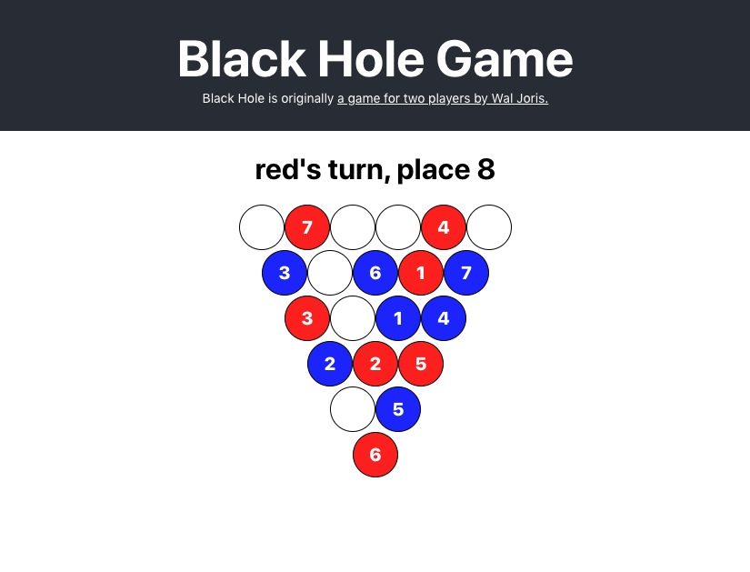

# Black Hole Game



This is a digital version of a physical two-player game where both players place numbers 1 through 10 turn after turn on a pyramid-shaped field with 21 spots. At the end of the game, there's one empty slot - the black hole.

Black hole then sucks in all the numbers touching it and the player with less points sucked in will win.

Current version of this game is a turn-based game to be played on the same computer.

Black Hole is originally [a game for two players by Wal Joris](https://nestorgames.com/#blackhole_detail).

## Developer Notes

Install packages

```
yarn install
```

Run development server

```
yarn start
```

Run tests (for new tests, create a file `*.test.js` in `tests/` folder)

```
yarn test
```

## LICENSE

Copyright 2020 Juha-Matti Santala

Permission is hereby granted, free of charge, to any person obtaining a copy of this software and associated documentation files (the "Software"), to deal in the Software without restriction, including without limitation the rights to use, copy, modify, merge, publish, distribute, sublicense, and/or sell copies of the Software, and to permit persons to whom the Software is furnished to do so, subject to the following conditions:

The above copyright notice and this permission notice shall be included in all copies or substantial portions of the Software.

THE SOFTWARE IS PROVIDED "AS IS", WITHOUT WARRANTY OF ANY KIND, EXPRESS OR IMPLIED, INCLUDING BUT NOT LIMITED TO THE WARRANTIES OF MERCHANTABILITY, FITNESS FOR A PARTICULAR PURPOSE AND NONINFRINGEMENT. IN NO EVENT SHALL THE AUTHORS OR COPYRIGHT HOLDERS BE LIABLE FOR ANY CLAIM, DAMAGES OR OTHER LIABILITY, WHETHER IN AN ACTION OF CONTRACT, TORT OR OTHERWISE, ARISING FROM, OUT OF OR IN CONNECTION WITH THE SOFTWARE OR THE USE OR OTHER DEALINGS IN THE SOFTWARE.
